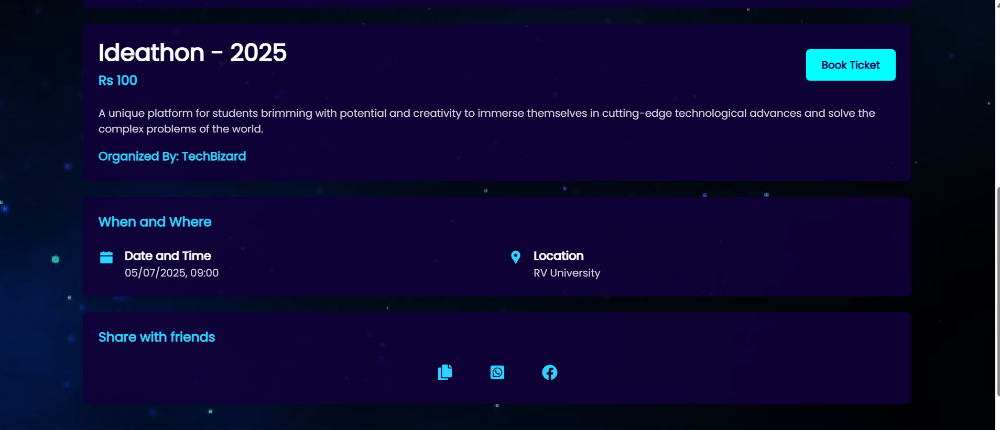

# Eventify: Manage, Register, Connect

Introducing our Event Management System designed to streamline campus event planning, registration, and ticket booking. I played a key role as the architect, creating the user interface where I incorporated modern design principles and prioritized user experience. We are developing the system using the MERN stack (MongoDB, Express.js, React.js, Node.js), and we are utilizing the agile Scrum methodology for efficient development.

**Skills:** *Figma · Ui/ux · React.js · MongoDB · Node.js · Express.js · Requirements Analysis · User Interface Design*

## Eventify: Manage, Register, Connect

Introducing our Event Management System designed to streamline campus event planning...

**Features**
* Schedule a Event.
* View upcoming events.
* View the event calendar.
* Ticket Booking for the event.
* QR Code generation for receiving tickets.

**Technologies Used**
* ReactJs
* NodeJs
* ExpressJs
* MongoDB
* NPM (Node Package Manager)
* JWT webtoken
* QR code

**_Getting Started_**

**Prerequisites**
* Node.js and npm installed
* MongoDB Database

**Instalaltion**
1. Clone the repository to your local machine.
2. Navigate to the project directory. use two terminal  
    **Cd Client** - For Frontend  
    **Cd api** - For Backend  
3. Install server dependenciesfor both frontend and backend.
4. Create a .env file in the root directory with the following content, and replace placeholders with your own values.  
     MONGODB_URI=mongodb://localhost/your-database-name
5. Start the server. 
     **/api:** nodemon start 
     if the command is not working use **PowerShell -ExecutionPolicy Bypass nodemon** this command.
7. Start the Client: 
      **/client:** npm run dev

**The application should now be running. You can access it at http://localhost:5173** 
**The Server is running on http://localhost:4000**

<h1>Thank You</h1>

